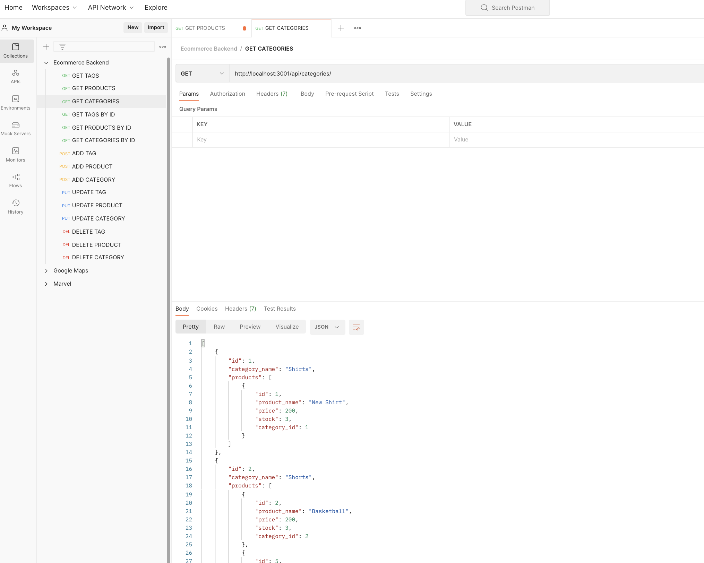
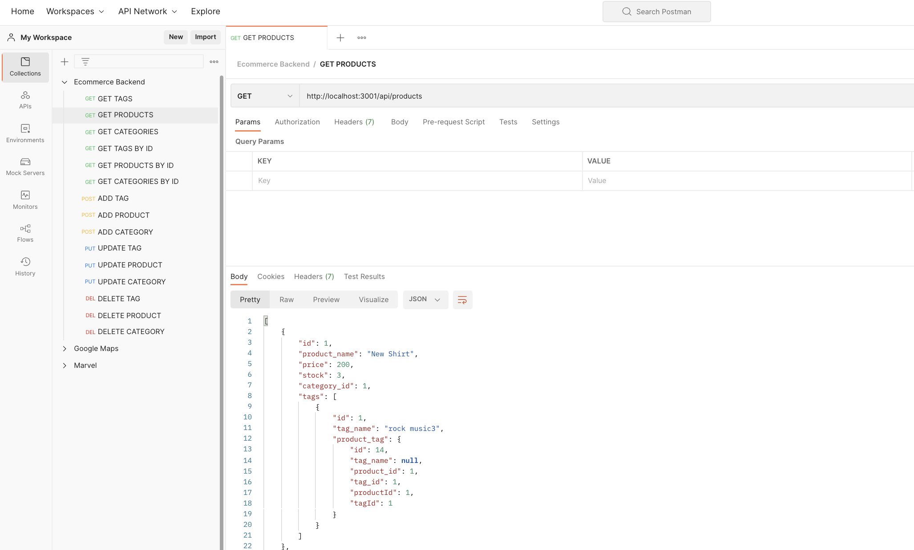
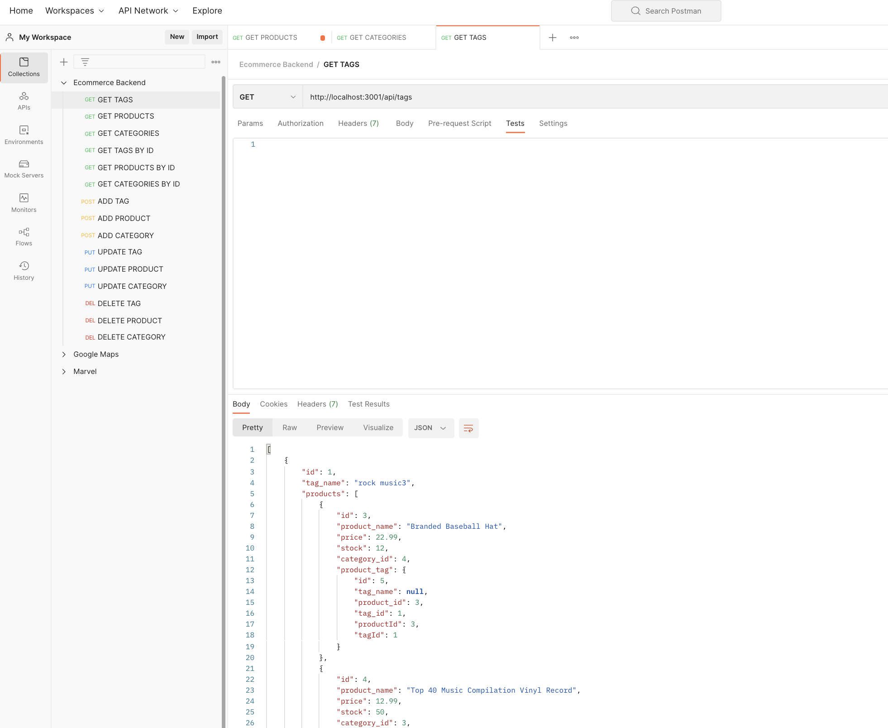

# Ecommerce Backend
<p />By Michael Martens

[](https://opensource.org/licenses/MIT)

## Description
This app standsup a functional API for an Ecommerce store. The store can be searched by Product, Category, or Tag and POST, PUT, PATCH, and DELETE methods can be performed.


<br>

<br>

<br>

## Table of Contents
[Installation](#installation)<br />[Usage](#usage)<br />[License](#license)<br />[Contributing](#contributing)<br />[Tests](#tests)<br />[Questions](#questions)

## Installation
Clone the repo > run ```npm install``` to intialize the included dependencies

You will also need to make sure that MySql is installed.

## Usage
Source and Seed the database by running ```mysql -u root -p``` to log into the database. Run ```source schema.sql``` followed by ```quit``` to cd back into the root folder. Then run ```node seeds/index.js``` to seed the db and ```npm start``` to begin using the application.

Postman or Insomnia can be used to make requests to the following:

http://localhost:3001/api/products/
<br>
http://localhost:3001/api/categories/
<br>
http://localhost:3001/api/tags/

or individual items

http://localhost:3001/api/products/{id}
<br>
http://localhost:3001/api/categories/{id}
<br>
http://localhost:3001/api/tags/{id}

## License
This project is licensed under the MIT license.

A short and simple permissive license with conditions only requiring preservation of copyright and license notices. Licensed works, modifications, and larger works may be distributed under different terms and without source code.<p />For more information visit https://choosealicense.com/licenses/mit/.

## Contributing
Other than what I learned in class, just myself! I grabbed most of my inspiration from the provided resources.

## Tests
None

## Questions
Find me on Github at https://github.com/makeithappenmike<p/>You can reach me at omichaelaaron@gmail.com if you have any questions.